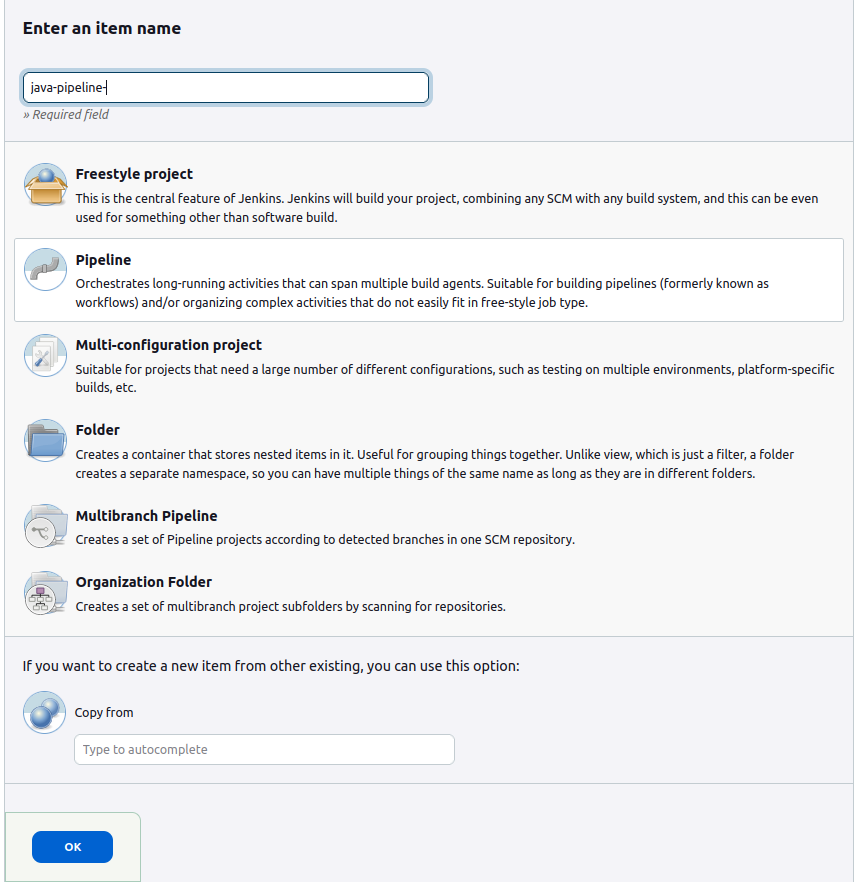
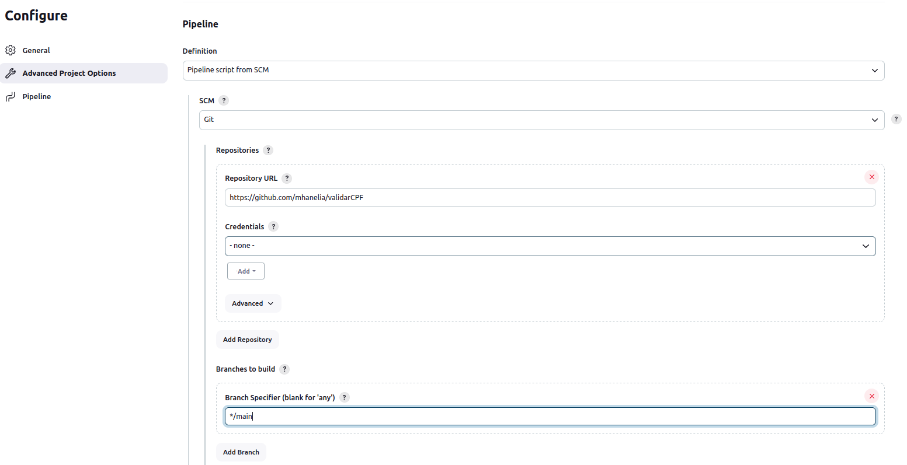
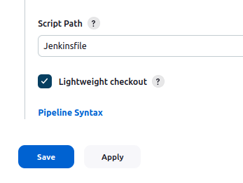

# Projeto para pipeline com Maven e Jenkins

## Requisitos: 

### Jenkins: 

[Como instalar o Jenkins no Ubuntu 22.04](https://www.digitalocean.com/community/tutorials/how-to-install-jenkins-on-ubuntu-22-04)

### Java: 

[Como instalar Java com Apt no Ubuntu 22.04](https://www.digitalocean.com/community/tutorials/how-to-install-java-with-apt-on-ubuntu-22-04)

## Criando a pipeline no Jenkins:
1 - Acesse a página inicial do Jenkins

2 - No menu lateral esquerdo, clique em "New Item"

3 - Dê um nome à sua pipeline, selecione a opção "Pipeline" e clique no botão "OK"

4 - Nas configurações da pipeline, você pode adicionar uma descrição e configurar os passos. Na opção Pipeline, vamos configurar da seguinte forma: 

* Definition: Pipeline script from SCM
* SCM: Git
* Repository URL: a URL do nosso projeto: https://github.com/mhanelia/validarCPF
* Branch Specifier: main
* Script Path: Jenkinsfile

5 - Feito isso, basta salvar clicando em "Save"

6 - Após clicar sobre a pipepline criada, você poderia ver os resultados e rodar quantas vezes forem necessárias:

